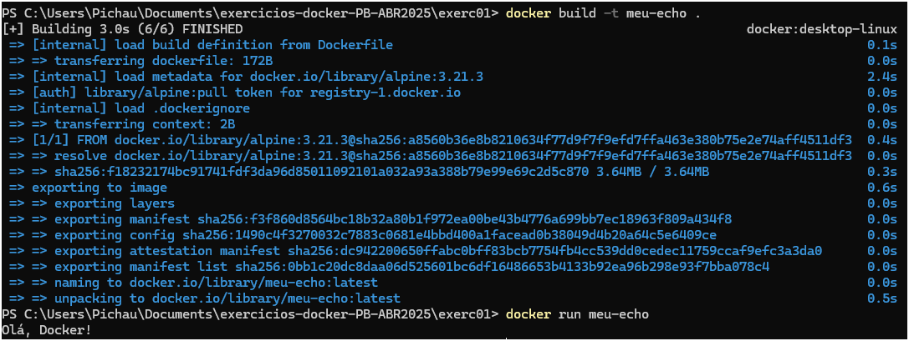

# Exercício Docker: Imagem `meu-echo`

Este repositório contém a solução para um exercício Docker simples, cujo objetivo é criar uma imagem Docker que imprime a mensagem "Olá, Docker!" ao ser executada.

## Objetivo

O principal objetivo deste exercício é demonstrar os passos básicos para:
- Criar um `Dockerfile`.
- Construir uma imagem Docker a partir do `Dockerfile`.
- Executar um container a partir da imagem construída.

## Conteúdo do `Dockerfile`

O arquivo `Dockerfile` define as instruções para construir a nossa imagem:

```dockerfile
# Use a imagem base alpine
FROM alpine

# Comando a ser executado quando o container iniciar
CMD ["echo", "Olá, Docker!"]
```

### Explicação das diretivas:

> FROM alpine: Esta linha especifica que estamos utilizando a imagem oficial alpine como base. Alpine Linux é uma distribuição Linux minimalista, ideal para criar imagens Docker leves.

> CMD ["echo", "Olá, Docker!"]: Esta linha define o comando padrão que será executado quando um container baseado nesta imagem for iniciado. O comando echo "Olá, Docker!" simplesmente imprime a string especificada no console.

## Passos para Construção e Execução
Siga os passos abaixo para construir a imagem e executar o container. Certifique-se de ter o Docker instalado e em execução na sua máquina.

1. Crie o Dockerfile
Copie o conteúdo acima e salve-o em um arquivo chamado Dockerfile (sem extensão) em um diretório de sua escolha.

2. Construa a Imagem Docker
Navegue até o diretório onde você salvou o Dockerfile usando o seu terminal e execute o seguinte comando:
```
docker build -t meu-echo .
```
- docker build: Comando para construir a imagem.

- -t meu-echo: Atribui a tag (nome) meu-echo à imagem.

- .: Indica que o contexto de construção (onde o Dockerfile está localizado) é o diretório atual.

## 3. Execute o Container
Após a imagem ser construída com sucesso, execute o seguinte comando para iniciar um container a partir dela:

```
docker run meu-echo
```
- docker run: Comando para executar um container a partir de uma imagem.
- meu-echo: Nome da imagem que acabamos de construir.

## Resultado Esperado
Ao executar o comando acima, você deverá ver a seguinte saída no terminal:

```
Olá, Docker!
```
Isso confirma que o container foi executado com sucesso e o comando echo dentro dele imprimiu a mensagem esperada.

## Demonstração

